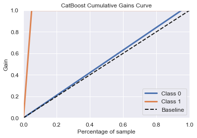

# E-COMMERCE ANALYSIS

# INTRODUCTION

_One of the reasons that businesses fail is lack of research, 
not being in the right market, and not reaching the right people. 
Research shows that 21.5% of small businesses and startups fail within the first year, 
30% within the second year, 50% within the fifth year, and 70% within their 10th year 
([source](https://www.investopedia.com/articles/personal-finance/040915/how-many-startups-fail-and-why.asp)). 
42% of business failures are a result of not understanding what 
people actually need or want ([source](https://www.lendingtree.com/business/small/failure-rate/)). This number is much higher for 
e-commerce and online businesses. Within four months, 90% of online businesses fail 
([source](https://www.huffpost.com/entry/10-reasons-why-your-new-online-business-will-fail_b_7053610)).
In order for businesses to succeed, they must be able to identify what metrics will 
improve profits for online stores. For this project, we will be exploring and analyzing 
a customer’s propensity to purchase and provide recommendations on how to increase and 
improve conversion rates and mitigate attribution issues._

# DATA

We will be using Google's Analytic 360 Data obfuscated sample data from the Google 
Merchandise store on their BigQuery Rest API. The sample dataset provides 12 months 
(August 2016 to August 2017), however we will only be focusing on 1 of those months 
within the data set (July 1, 2017 to July 31, 2017) and analyzing behavior up to 2 weeks 
before a transaction is made.

The [overview](https://console.cloud.google.com/marketplace/product/obfuscated-ga360-data/obfuscated-ga360-data?project=lexical-script-761) 
describes the data as typical of what an ecommerce website would see and includes the following 
information:
- Traffic source data
- Content data
- Transactional data

#### CONSTRAINTS
- All users have view access to the dataset and can only query the dataset and generate 
  reports
- Data for some fields is obfuscated such as ___fullVisitorId___
- Data for some field is removed such as ___clientId___, ___adWordsClickInfo___ and 
  ___geoNetwork___
- “Not available in demo dataset” will be returned for STRING values
- “null” will be returned for INTEGER values when querying the fields containing no data

#### SET-UP

To use BigQuery, you will need to sign up for an account, get an API key, and download 
the google.cloud package to query the API from jupyter notebook. Follow the instructions here
for [quick start](https://cloud.google.com/bigquery/docs/quickstarts/quickstart-client-libraries) and 
[authentication](https://cloud.google.com/docs/authentication/getting-started#cloud-console). 
You may also query from Google Cloud if that’s easier.

#### LANGUAGES USED:
- Python
- Standard SQL

#### PACKAGES USED:
- __sklearn__ for preprocessing, modeling the data, and calculating metrics
- __pandas__ and __numpy__ for data wrangling and reformatting
- __matplotlib__ and __seaborn__ for data and metric visualization
- __google.cloud__ to query the API from jupyter notebook

# EDA (OVERVIEW)

Before wrangling the data, we need to visualize how the data is formatted.

_For a full breakdown and justification of features chosen, please see 
[01_eda_data_overview.ipynb](01_eda_data_overview.ipynb)._

Our goal is to find features that give us a high-level overview of each unique visitor’s behavior 
over multiple sessions. We are concerned about a customer's propensity to buy based on transactions 
and behaviors over multiple sessions by days and weeks. Some features of this data are nested and 
need to be accessed within a column via a query. The high-level features are as follows:

- visitorId
- visitNumber
- visitId
- visitStartTime
- date
- totals
- trafficSource
- device
- geoNetwork
- customDimensions
- hits
- fullVisitorId
- userId
- clientId
- channelGrouping
- socialEngagementType

Based on our thorough examination of each feature, the column that will be most useful in creating our features 
and labels will be the following features in the ___totals___ column:

- ___fullVisitorId___ - to identify each unique visitor regardless of what day they visit on
- ___date___ - to view total transactions by day
- ___visits___ - this represents the number of sessions
- ___hits___ - total number of interactions within a session
- ___pageviews___ - total number of page views in a session
- ___bounces___ - total bounces. These trigger in the Analytics server if only a single interaction is made on the whole website
- ___sessionQuality___ - an estimate of how close a particular estimate was close to transacting from 1 to 100 with 1 being the lowest session quality and 100 being close to transacting
- ___timeOnSite___ - total time of each session in seconds

Based on the question we're trying to answer, we will be using ___transactions___ to help us create 
our labels and whether a visitor makes a purchase.
 
The other features, as noted above have either been deprecated, are not available in the demo 
dataset, are duplicates, or are not aligned with our goal of providing a high-level overview of 
each visitor’s behavior.

# DATA CLEANING AND DATA WRANGLING

For this next step, I will be using functions to call each query. 
We need to set up the start and end dates as well as indicate whether this dataset 
will be a train or test set.

We will be performing the following steps (please note each step except for the final step 
will create a temporary table in your BigQuery project. You can view the results of your 
table there):

1. Getting the transaction dates where the earliest known transaction of each user occurs
2. Getting and creating the features by visitor id and by each user's visit date from the 
   transaction date. Because each feature is recorded for each session, we need to create a 
   training data set that aggregates all these features. We will be summing all features except 
   for sessionQuality. We will average the session quality by day and round to two decimal points.
   We need to separately query visitors who made purchases from visitors who didn't make purchases
3. Breaking out each feature by difference in days and weeks prior to the transaction date. Again, 
   we need to separately query visitors who made purchases from visitors who didn't make purchases. 
   For users that made no transactions, we will pick 5 random days as our false 'transaction' dates 
   and remove any duplicate visitors who may have made purchases on other days and none on others. 
   We wil then break out the features in the following format:
    - day0 - behavior on site on the day of the first transaction
    - day1 - behavior on site 1 day before the first transaction
    - day2 - behavior on site 2 days before the first transaction
    - day3 - behavior on site 3 days before the first transaction
    - day4_6 - behavior on site 4-6 days before the first transaction
    - w2 - behavior on site 7-14 days before the first transaction (or behavior within two weeks before the first transaction)

Combining the temporary true feature and false feature tables in step 3 and labeling them 
(1 for purchase, 0 for no purchase) to create our training dataset.
We will also limit the number of false transactions to 19,000 and downsample 
our data to provide a reasonable ratio of true and false purchases.
For further documentation, go to the [python](python/) folder of this project and view all queries.
For brevity, we will combine each query and simultaneously create our temporary tables for the 
training dataset.

The final query will not create a temporary table. Instead, we will transform the results 
into a dataframe that we can analyze, preprocess, and model in the next notebooks.

#### CREATE VALIDATION DATA
In order to accurately see if our model works we will pick a date interval completely independent 
of the train or test set and apply the same pipeline to create our validation set.

# EDA OF TRANSFORMED FEATURES

### % of Missing Data:

|LABEL                    | %         |
|-------------------------|-----------|
|visitor_id               |       0.00|
|day0_time_on_site_seconds|      80.69|
|day1_time_on_site_seconds|      85.97|
| day2_time_on_site_seconds |      87.45| 
| day3_time_on_site_seconds   |    87.32| 
| day4_6_time_on_site_seconds|     72.10| 
| w2_time_on_site_seconds  |       33.09| 
| day0_hits|                       80.69| 
| day1_hits |                      85.97| 
| day2_hits |                      87.45| 
| day3_hits |                      87.32| 
| day4_6_hits|                     72.10| 
| w2_hits       |                  33.09| 
| day0_pageViews              |    80.69| 
| day1_pageViews            |      85.97| 
| day2_pageViews          |        87.45| 
| day3_pageViews        |          87.32| 
| day4_6_pageViews    |            72.10| 
| w2_pageViews      |              33.09| 
| day0_bounces                 |   80.69| 
| day1_bounces               |     85.97| 
| day2_bounces             |       87.45| 
| day3_bounces           |         87.32| 
| day4_6_bounces               |   72.10| 
| w2_bounces                 |     33.09| 
| day0_sessions                  | 80.69| 
| day1_sessions                |   85.97| 
| day2_sessions               |    87.45| 
| day3_sessions                |   87.32| 
| day4_6_sessions               |  72.10| 
| w2_sessions                  |   33.09| 
| day0_session_quality          |  80.69| 
| day1_session_quality          |  85.97| 
| day2_session_quality          |  87.45| 
| day3_session_quality           | 87.32| 
| day4_6_session_quality         | 72.10| 
| w2_session_quality             | 33.09| 
| label                          |  0.00| 

There is a lot of missing data, but this is normal because users do not interact with a website 
everyday. We don't want to fill this information or delete it as the missing data is important 
to understanding the behavior of each user.

#### DISTRIBUTION

Based on the ratio between no transactions and confirmed transactions we can see that user 
transactions only make up about 4.8% of the data. 
This implies that our labels are highly skewed. We will need to take this into account when 
building our model and considering what metrics will be appropriate to use and possibly normalizing
or standardizing the data for preprocessing.
Let's look at the behavior and distribution of each feature by label to get an overall idea 
of how each visitor behaves the days and weeks prior to transaction or lack thereof.

 
Based on the general overview and distribution of features for users who made purchases, 
we can see that there are more interactions less than 6 days leading up to the transaction 
in comparison to the 7-14 days prior.

The time on site, hits, page views, bounces, sessions, and session quality all experience an
increase in user interactions, particularly on the day0, day1, and day2 prior to purchase. 
This intuitively makes sense that users spend more time on the site the day of the transaction. 
It also makes sense that they spend more and more time on site leading up to the purchase since 
visitors potentially do research, compare prices, and determine their final decisions.

 
Based on the general overview and distribution of features for users who made no purchases 
as the "transaction" date gets closer, less and interactions are made on site.
The time on site, hits, page views, bounces, sessions, and session quality all experience a 
slight increase in user interactions, particularly between day0 and day1. 

However, in comparison 
to users who made purchases, they drastically spend less time on the website. Interestingly, 
the total number of bounces per user per day was on average higher for no purchases versus users 
who made purchases. This suggests bounces might be a significant indicator in predicting a 
customer's propensity to purchase.

Based on the heatmap above, hits and page views are very positively correlated. 
We may need to be aware of multicollinearity for those features. Here we can see that there 
is a negative correlation between time on site, hits, page views and session quality with bounces. 
There is also a strong positive and negative correlation for all features 1 day before a 
transaction except sessions.

 
Looking at a preview of the data once again and at the percentage of customers 
who don't purchase (label 0) vs. customers who do purchase (label 1), we can see that 
customers who make a purchase make up less than 5% of the dataset. In other words, the 
data is highly imbalanced and customers making a purchase is considered a rare event. 
The violin boxplot also shows that there are significant outliers in the data.

# PRE-PROCESSING

We will perform each the following pre-processing techniques to mitigate any biases and inaccuracies in predicting customer propensity:

- Scaling (Standardization)
- Impute missing data

The null values in the data are valuable in and of itself. They represent the days that each visitor 
was not present on the site. We can impute the data by filling each null value with zeroes.

Scaling the data down did normalize the standard deviation close to 1 and the mean close to 0. 
However, it looks like we are still dealing with very large outliers and a skewed distribution.

# METHODOLOGY

We will be using the following models for our transformations:

- CatBoost
- Random Forest
- Logistic Regression

Please note that depending on the goals of the company, certain features included may be dropped or added as needed
The model in its current form is simplified. It has no consideration for platform constraints which would 
need to be defined by the company

We will be looking at overall accuracy on the first pass to determine if the model is sampling
from the data properly. We will then look at the following metrics:

- ROC curve to measure True Positive Rating
- LIFT score for customer segmentation information; this is our most important feature in identifying our target users
- SHAP value (impact on model output) for CatBoost or feature importance on 
  Random Forest and Logistic Regression

# RESULTS

#### BEST MODEL: CATBOOST

CatBoost had the highest LIFT score with a 99.91% model accuracy, successfully identified most users 
who purchased and had a True Positive Rating similar to Random Forest Model without overfitting.

#### Random Forest
The Random Forest model in comparison had a lower LIFT score.

#### WORST MODEL: LOGISTIC REGRESSION

The model had a 100% accuracy, but had the lowest lift score and lowest true positive rating
This suggest suggests severe overfitting occuring to the data

#### Feature Importance:
Based on analysis of each feature, user engagement increases as they approach the purchase date (day0).
Transactions and activities are highly correlated to the day of purchase. Page views, 
session quality, and time on site had the highest positive correlations.
Bounces have a negative correlation. This suggests that the company should continue minimizing bounces or single
touch points.

# APPLICATIONS

Some applications for this model include:

- Identifying the segments of users likely to organically convert and allocating a budget to market to 
  this segment and mitigate attribution
- Optimizing email and marketing campaigns to specific users
- Providing discounts for other segments less likely to convert
- Encouraging users to make purchases via paid media marketing campaigns (on Amazon, Facebook, Instagram, etc.)
- Improving customer service by Rerouting and prioritizing calls based on propensity to purchase

# LESSONS LEARNED

In conclusion, there are numerous other models that could have been explored using Google's Big Query Data including:

- ADA Boost
- XG Boost 

We could've also corrected for overfitting in the models using:
- Cross Validation
- Bootstrapping.

Other factors to improve the model include:
- Refining the preprocessing pipeline by normalizing the distribution of the data via:
  - upsampling 
  - downsampling 
  - log transformation
- filling null values with:
  - mean of each feature
  - median of each feature 

# THANK YOU!
Thank you Nik for being an amazing mentor. It was wonderful working with you.

# SOURCES

- https://www.investopedia.com/articles/personal-finance/040915/how-many-startups-fail-and-why.asp
- https://www.lendingtree.com/business/small/failure-rate/
- https://www.huffpost.com/entry/10-reasons-why-your-new-online-business-will-fail_b_7053610
- https://console.cloud.google.com/marketplace/product/obfuscated-ga360-data/obfuscated-ga360-data?project=lexical-script-761
- https://support.google.com/analytics/answer/3437719?hl=en
- https://www.analyticsvidhya.com/blog/2017/08/catboost-automated-categorical-data/
- Stack Overflow

